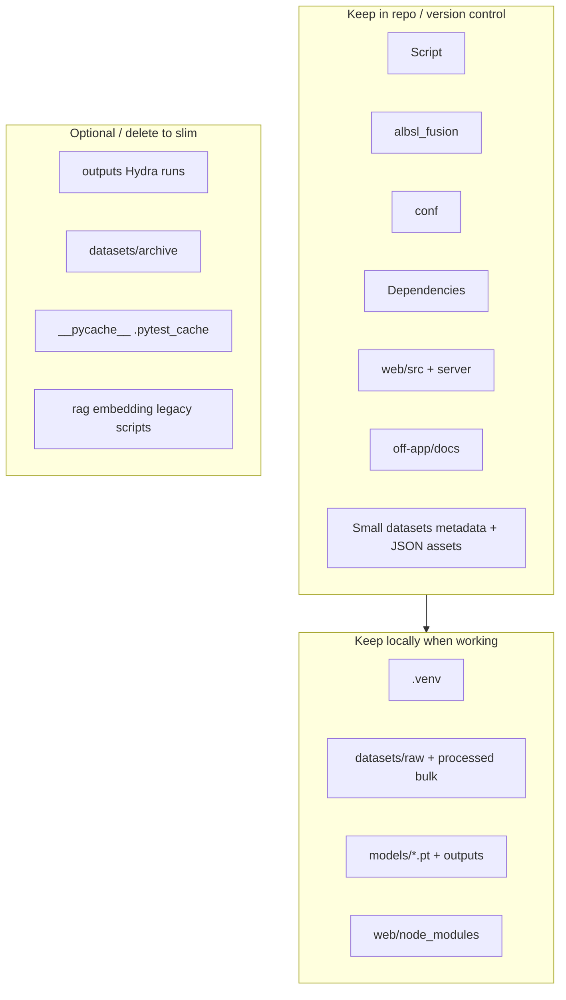

# AlbSl-Dataset-v2 — What to Keep (Project Inventory)

This document summarizes what each part of the repository is for, whether you need it on disk or in Git, and how to slim a large working tree. For architecture and commands, see [off-app/docs/DOCUMENTATION.md](off-app/docs/DOCUMENTATION.md).

The repo is large mainly because of **local data** (often ~2+ GB under `datasets/`), **Python environment** (`.venv/`), **web dependencies** (`web/node_modules/`), **Hydra outputs** (`outputs/`), and **artifacts** (`*.pt`, `*.h5`, `keypoints.h5`). **Tracked source code is small** (~15 MB in `Script/`).



## Size snapshot (typical checkout)

Sizes vary by machine; order of magnitude:

| Path | Typical size | In `.gitignore`? |
|------|--------------|------------------|
| `datasets/` | ~2+ GB | partial (many binaries not tracked) |
| `datasets/raw/` | ~1.5 GB | varies |
| `datasets/processed/` | ~0.5–1 GB | partial |
| `.venv/` | ~1.5 GB | yes |
| `outputs/` | ~400 MB | no (regenerable) |
| `web/` (with `node_modules`) | ~200+ MB | `node_modules`, `dist`, wasm |
| `keypoints.h5` | ~80 MB | yes (`*.h5`) |
| `models/` | ~40 MB | `*.pt`, checkpoints |
| `Script/` | ~15 MB | no |
| Everything else (code/config/docs) | under 1 MB | no |

## Master table — top-level directories

| Path | Necessary? | Keep in Git? | Role | Remove if… |
|------|------------|--------------|------|------------|
| `Script/` | **Yes** (core) | Yes | All Python: pipeline, train, live apps; web backend imports | Never (this is the product) |
| `albsl_fusion/` | **Yes** if fusion track | Yes | Multimodal model + dataloaders for `Script/train.py` | You only use BERT/v3 and never `train.py` |
| `conf/` | **Yes** if fusion track | Yes | Hydra configs for fusion training | Same as above |
| `Dependencies/` | **Yes** | Yes | `requirements.txt`, web/train variants, Windows install scripts | Never |
| `web/` | **Yes** if Web UI | Yes (source only) | React UI + `web/server/main.py`; run `npm install` locally | You only use OpenCV `albsl_app_v2` CLI |
| `datasets/` | **Yes** (data) | Partial | Raw media + processed CSV/NPZ/JSON/Parquet — see [datasets/README.md](datasets/README.md) | Data lives elsewhere; keep minimal JSON assets only |
| `models/` | **Yes** at runtime | Partial | `hand_landmarker.task`, `model_full.pt`, `label_map.json` — see [models/README.md](models/README.md) | Re-download task; re-train weights |
| `off-app/` | **Recommended** | Yes | Docs, pytest, Docker for v2 | You do not need tests/docs |
| `README.md` | **Yes** | Yes | Entry + OpenCV fix | Never |
| `PROJECT_INVENTORY.md` | **Recommended** | Yes | This file | — |
| `pyrightconfig.json`, `.vscode/` | Optional | Yes | IDE typing only | Anytime |
| `.venv/` | Local only | No | Python packages | Recreate: `pip install -r Dependencies/requirements.txt` |
| `outputs/` | Regenerable | Optional | Hydra run logs/config snapshots | Safe to delete; re-created by `train.py` |
| `keypoints.h5` | **Only v2 legacy path** | No | HDF5 recordings for `albsl_app_v2` train/live | Not using v2 MLP / legacy H5 |
| `.pytest_cache/`, `__pycache__/` | No | No | Caches | Always safe to delete |
| `AlbSl-datasets-backup.zip` | Optional | No | Offline backup of `datasets/` (if you created one) | After data is stored elsewhere |

**Legend — Necessary?**

- **Yes** = required for that workflow to run
- **Recommended** = not runtime-critical but valuable
- **Local only** = needed on disk, not in git
- **Regenerable** = can delete and recreate
- **Only if …** = conditional on which app/train path you use

## `Script/` — which files matter

| Script | Necessary? | Workflow |
|--------|------------|----------|
| `albsl_app_v2.py` | Core for **v2 / Web UI** | diagnose/train/live; BERT via `--albsl-model` |
| `albsl_live_engine.py` | Core for **Web live** | Imported by `web/server/main.py` |
| `consolidate_data.py` | Core for **BERT train** | Builds Parquet for `train_albsl.py` |
| `train_albsl.py` | Core for **BERT train** | Outputs under `models/trained/` |
| `confirmed_csv_io.py` | Core | Shared CSV parsing + merge into `confirmed_labels.csv` |
| `path_utils.py` | Yes | Shared path resolution |
| `extract_keypoints_v2.py` | Optional | NPZ extraction from video/images |
| `merge_*`, `merge_coordinates_into_confirmed.py`, `external_import_normalize.py`, `run_csv_pipeline.py` | Optional | CSV/JSON merges and orchestration |

## `datasets/` — what to keep

| Subpath | Necessary? | Notes |
|---------|------------|-------|
| `datasets/raw/` | **Yes** if (re)building from images | Largest folder; original Alfabeti / media |
| `datasets/processed/core_data/data/csv/` | **Yes** for fusion + consolidation | `alfabeti_keypoints.csv`, video CSVs (when present) |
| `datasets/processed/core_data/data/keypoints/` | **Yes** for v2 train | `*.npz` per letter (often local-only) |
| `datasets/processed/assets/*.json` | **Yes** for apps | `albsl_landmarks.json`, words dict, dynamic templates — small, high value |
| `datasets/processed/consolidated/` | **Yes** for BERT train | Created by `consolidate_data.py` (Parquet); can regenerate |
| `datasets/csv_dataset/`, `datasets/json_dataset/` | Optional | Staging / unified JSON; see [datasets/README.md](datasets/README.md) |
| `datasets/archive/` | Optional | Historical snapshots; safe to archive off-disk |
| `datasets/processed/landmarks/albsl_landmarks/` | Partial | Per-letter JSON KB; overlaps `assets/albsl_landmarks.json` |

### Archiving `datasets/` off-repo

To move data out of the project folder, zip and copy elsewhere:

```powershell
tar -a -cf AlbSl-datasets-backup.zip -C . datasets
# Restore later:
tar -xf AlbSl-datasets-backup.zip -C D:\path\to\AlbSl-Dataset-v2
```

## Minimum sets by goal (slim footprint)

| Your goal | Minimum folders on disk |
|-----------|-------------------------|
| **Web UI only** (diagnose/train/live in browser) | `Script/` (v2 + live_engine), `web/` (src + server + `node_modules`), `Dependencies/`, `.venv`, `datasets/processed/assets/*.json`, trained `outputs/albsl_mlp.pt` or path in settings, optional `keypoints.h5` |
| **OpenCV v2 live only** | `Script/albsl_app_v2.py`, `Dependencies/`, `.venv`, `models/mediapipe/mp_models/hand_landmarker.task`, `outputs/albsl_mlp.pt`, optional NPZ/H5 |
| **BERT + v2 live** | `Script/albsl_app_v2.py`, `outputs/albsl_mlp.pt`, `models/trained/albsl_model_final/`, `datasets/csv_dataset/confirmed_labels.csv`, `.venv` |
| **CSV → Parquet → BERT** | `run_csv_pipeline.py` or `consolidate_data.py` + `train_albsl.py` |

## Practical slimming (largest wins)

1. **Do not commit** `.venv/`, `web/node_modules/`, `web/dist/`, `*.pt`, `*.h5`, `*.task` (see [.gitignore](.gitignore)).
2. **Delete locally** if not needed: `outputs/`, `.pytest_cache/`, `__pycache__/`.
3. **Move off-machine** (external drive or zip): `datasets/raw/` once processed artifacts exist.
4. **Drop** `keypoints.h5` if you are not training/recording with the v2 legacy H5 path.
5. **Web UI** lives in [`web/`](web/README.md) (React + FastAPI), not `lahuta-ui-main/`.
